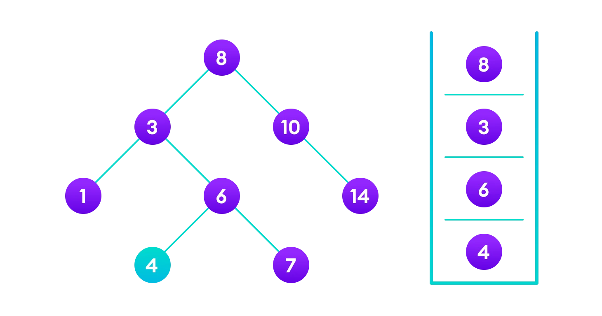
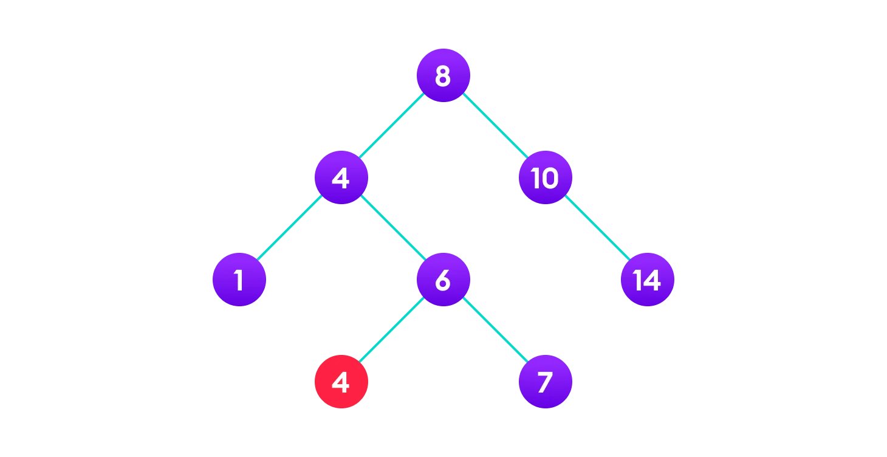

# Binary Search Tree (BST)

This article cover:
1. [Binary Search Tree(BST)](https://www.programiz.com/dsa/binary-search-tree)

## Intro

Binary search tree is a data structure that quickly allows us to maintain a sorted list of numbers.

* It is called a binary tree because each tree node has a maximum of two children.
* It is called a search tree because it can be used to search for the presence of a number in `O(log(n))` time.

The properties that separate a binary search tree from a regular binary tree is

1. All nodes of left subtree are less than the root node
2. All nodes of right subtree are more than the root node
3. Both subtrees of each node are also BSTs i.e. they have the above two properties


> A tree having a right subtree with one value smaller than the root is shown to demonstrate that it is not a valid binary search tree

The binary tree on the right isn't a binary search tree because the right subtree of the node "3" contains a value smaller than it.

## Operations
### **Search Operation**

The algorithm depends on the property of BST that if each left subtree has values below root and each right subtree has values above the root.

If the value is below the root, we can say for sure that the value is not in the right subtree; we need to only search in the left subtree and if the value is above the root, we can say for sure that the value is not in the left subtree; we need to only search in the right subtree.

Algorithm:
```python
If root == NULL 
    return NULL;
If number == root->data 
    return root->data;
If number < root->data 
    return search(root->left)
If number > root->data 
    return search(root->right)
```

Let us try to visualize this with a diagram. Find 4.

1. 4 is not found so, traverse through the left subtree of 8
   
    

2. 4 is not found so, traverse through the right subtree of 3

    

3. 4 is not found so, traverse through the left subtree of 6

    

4. 4 is found

    

If the value is found, we return the value so that it gets propagated in each recursion step as shown in the image below.

If you might have noticed, we have called return search(struct node*) four times. When we return either the new node or NULL, the value gets returned again and again until search(root) returns the final result.


If the value is not found, we eventually reach the left or right child of a leaf node which is NULL and it gets propagated and returned.

### Insert Operation

Inserting a value in the correct position is similar to searching because we try to maintain the rule that the left subtree is lesser than root and the right subtree is larger than root.

We keep going to either right subtree or left subtree depending on the value and when we reach a point left or right subtree is null, we put the new node there.

Algorithm:
```cpp
If node == NULL 
    return createNode(data)
if (data < node->data)
    node->left  = insert(node->left, data);
else if (data > node->data)
    node->right = insert(node->right, data);  
return node;
```

The algorithm isn't as simple as it looks. Let's try to visualize how we add a number to an existing BST. Let's add 4.

1. 4<8 so, transverse through the left child of 8
   
    

2. 4>3 so, transverse through the right child of 8

    

3. 4<6 so, transverse through the left child of 6

    

4. Insert 4 as a left child of 6

    

We have attached the node but we still have to exit from the function without doing any damage to the rest of the tree. This is where the `return node;` at the end comes in handy. In the case of `NULL`, the newly created node is returned and attached to the parent node, otherwise the same node is returned without any change as we go up until we return to the root.

This makes sure that as we move back up the tree, the other node connections aren't changed.


### **Deletion Operation**

There are three cases for deleting a node from a binary search tree.

#### **Case I**

In the first case, the node to be deleted is the leaf node. In such a case, simply delete the node from the tree.


#### **Case II**

In the second case, the node to be deleted lies has a single child node. In such a case follow the steps below:

1. Replace that node with its child node.
2. Remove the child node from its original position.

> 6 is to be deleted


> copy the value of its child to the node and delete the child


> Final tree


#### **Case III**

In the third case, the node to be deleted has two children. In such a case follow the steps below:

1. Get the inorder successor of that node.
2. Replace the node with the inorder successor.
3. Remove the inorder successor from its original position.

> 3 is to be deleted


> Copy the value of the inorder successor (4) to the node



> Delete the inorder successor


## **Some Interesting Facts**

1. **Inorder traversal of BST always produces sorted output**.

2. We can construct a BST with only Preorder or Postorder or Level Order traversal. Note that we can always get inorder traversal by sorting the only given traversal.

## Binary Search Tree Complexities

**Time Complexity**

| Operation | Best Case | Average Case | Worst Case |
| --: | :--: | :--: | :--: |
| Search |O(log n) | O(log n) | O(n) |
| Insertion | O(log n) | O(log n) | O(n) | 
| Deletion | O(log n) | O(log n) | O(n) |

Here, `n` is the number of nodes in the tree.

**Space Complexity**

The space complexity for all the operations is `O(n)`.

## Binary Search Tree Applications

* In multilevel indexing in the database
* For dynamic sorting
* For managing virtual memory areas in Unix kernel